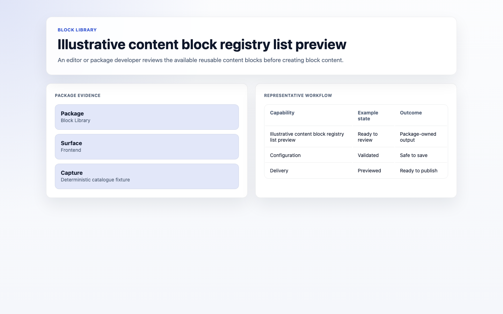
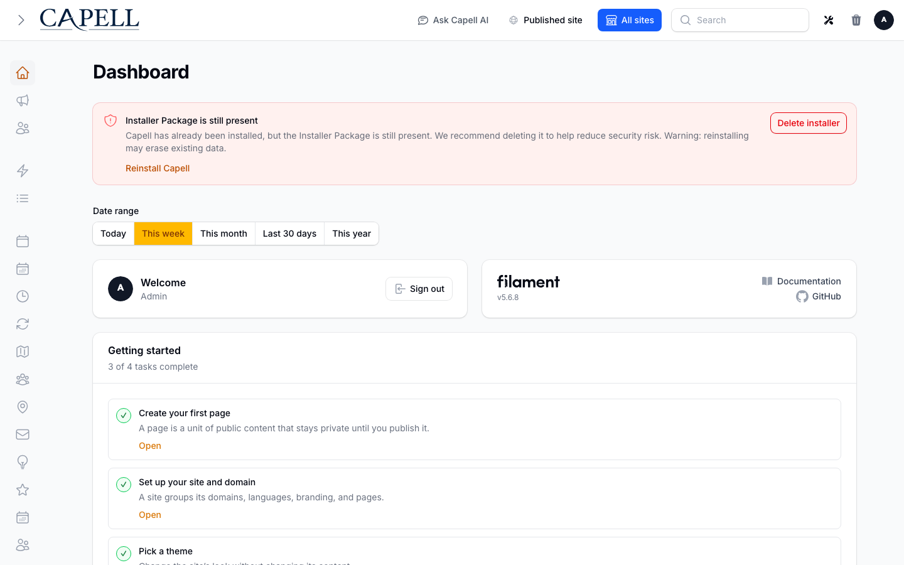
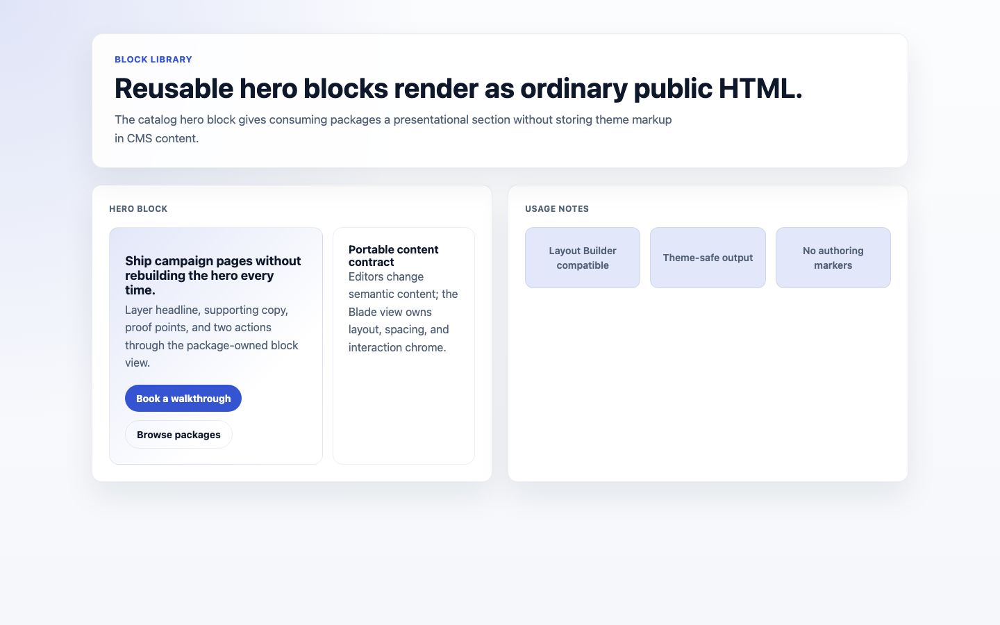
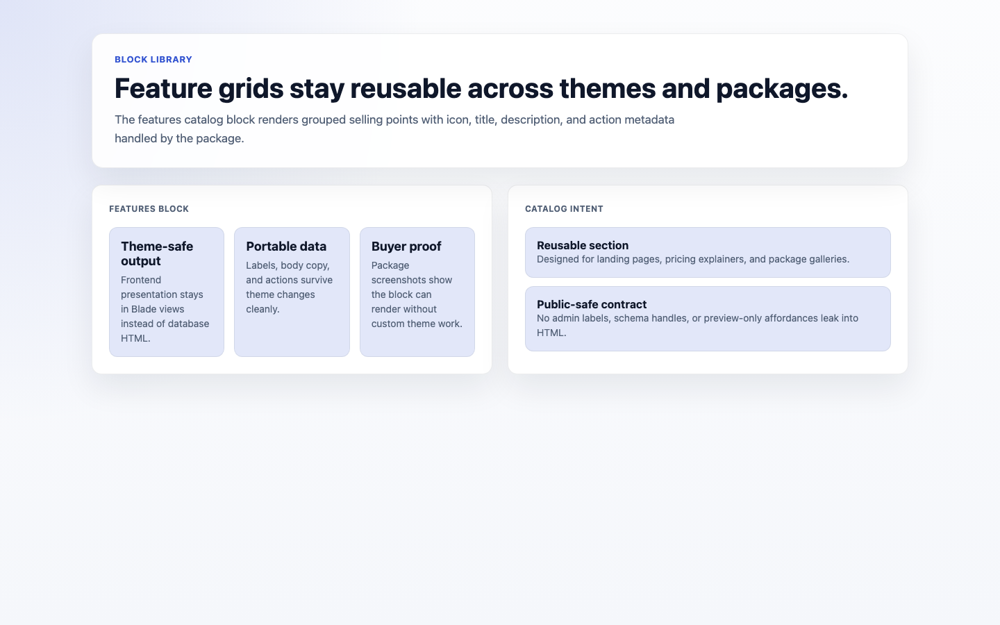
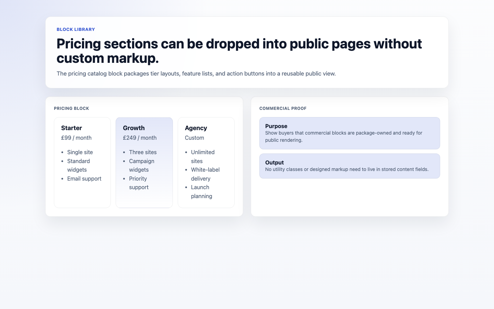

# Block Library

<!-- prettier-ignore-start -->

## What This Plugin Adds

Block Library is an **Available**, **No schema impact** Capell package in the **Capell Foundation** product group. It ships as `capell-app/block-library` and extends these surfaces: admin, frontend, shared.

Block Library provides reusable content blocks, typed definitions, fixtures, demo payloads, screenshots, and Filament Builder blocks for Capell content packages.

After install, admins get package-owned management surfaces and public users may see package-owned frontend output or routes.

Status details:

- Status: Available
- Tier: free
- Bundle: foundation
- Composer package: `capell-app/block-library`
- Namespace: `Capell\BlockLibrary`
- Theme key: not applicable

## Why It Matters

**For developers:** The package gives developers package-owned service providers, Actions, Data objects, Filament classes, and Blade views instead of pushing this behaviour into core or application code.

**For teams:** Reusable foundation content blocks with typed definitions, fixtures, demo payloads, screenshots, and Filament Builder blocks for Capell packages.

## Screens And Workflow

Screenshot contract: `screenshots.json`.

- Content block registry list (admin, required).
- Content block editor form (admin, required).
- Content block asset settings (admin, required).
- Frontend hero block (frontend, required).
- Frontend features block (frontend, required).
- Frontend pricing block (frontend, required).

Marketplace screenshot policy: keep the gallery curated. `screenshots.json` may track broader admin/frontend runner evidence for the full catalog, but `capell.json marketplace.screenshots` should only promote captures that are route-backed, visually reviewed, and useful to buyers. Promote additional catalog blocks only when the capture proves a distinct block family or workflow that the current gallery does not already communicate.

## Screenshot Evidence

These captures are the package-owned visual contract for the admin pages, public pages, actions, workflows, and feature surfaces described above. Keep this section aligned with `docs/screenshots.json` whenever the package surface changes.

### Content block registry list

- Surface: admin · Target: content-block-registry.
- Documents: An editor or package developer reviews the available reusable content blocks before creating block content.
- Capture notes: Capell runner capture proving the installed block catalog is visible from the admin registry surface.

### Content block editor form

- Surface: admin · Target: content-block-editor.
- Documents: An editor creates reusable block content with block-specific settings and preview data.
- Capture notes: Capell runner capture proving a reusable block can expose editable fields in the admin surface.

### Content block asset settings

- Surface: admin · Target: content-block-assets.
- Documents: An editor configures media-backed block content before publishing it through a consuming package.
- Capture notes: Capell runner capture proving reusable block assets can be represented in the admin flow.

### Frontend hero block

- Surface: frontend · Target: capell-block-library::blocks.catalog.hero.
- Documents: A buyer verifies the package ships ready-to-render frontend block views.
- Capture notes: Capell runner capture proving the hero catalog block renders as ordinary public HTML.

### Frontend features block

- Surface: frontend · Target: capell-block-library::blocks.catalog.features.
- Documents: A buyer verifies reusable feature sections can be rendered by consuming packages.
- Capture notes: Capell runner capture proving a multi-card catalog block renders safely on the frontend.

### Frontend pricing block

- Surface: frontend · Target: capell-block-library::blocks.catalog.pricing.
- Documents: A buyer verifies reusable pricing sections can be rendered without custom theme work.
- Capture notes: Capell runner capture proving commercial block layouts render through the frontend catalog views.

## Technical Shape

- Service providers: `Capell\BlockLibrary\Providers\BlockLibraryServiceProvider`.
- Filament classes: `AbstractCatalogBuilderBlock`, `AccordionBlock`, `CallToActionBlock`, `ComparisonBlock`, `ContentBlock`, `CounterBlock`, `DividerBlock`, `FaqBlock`, `FeaturesBlock`, `HeroBlock`, `LogosBlock`, `PricingBlock`, `and 6 more`.
- Actions: `ListBlockDefinitionsAction`, `ListBuilderBlockPickerItemsAction`, `RegisterBlockDefinitionProviderAction`, `ResolveBlockDefinitionAction`.
- Data objects: `AdminPreviewBlockViewReference`, `BlockAccessibilityContractData`, `BlockCompatibilityData`, `BlockContentContractData`, `BlockDefinitionData`, `BlockFixtureData`, `BlockScreenshotData`, `BlockSettingDefinitionData`, `BlockVariantData`, `BlockVariantKey`, `BuilderBlockPickerItemData`, `PublicBlockPresentationData`, `PublicBlockViewReference`.
- Health checks: `Capell\BlockLibrary\Health\BlockLibraryHealthCheck` verifies registry bindings, default definitions, accessibility contracts, fixture/demo providers, translations, views, builder blocks, screenshots, and manifest wiring.
- Blade views: `packages/block-library/resources/views/blocks/catalog/accordion.blade.php`, `packages/block-library/resources/views/blocks/catalog/call-to-action.blade.php`, `packages/block-library/resources/views/blocks/catalog/comparison.blade.php`, `packages/block-library/resources/views/blocks/catalog/content.blade.php`, `packages/block-library/resources/views/blocks/catalog/counter.blade.php`, `packages/block-library/resources/views/blocks/catalog/divider.blade.php`, `packages/block-library/resources/views/blocks/catalog/faq.blade.php`, `packages/block-library/resources/views/blocks/catalog/features.blade.php`, `packages/block-library/resources/views/blocks/catalog/hero.blade.php`, `packages/block-library/resources/views/blocks/catalog/logos.blade.php`, `packages/block-library/resources/views/blocks/catalog/pricing.blade.php`, `packages/block-library/resources/views/blocks/catalog/stats.blade.php`, `and 7 more`.
- Cache tags: `block-library`.

## Data Model

This package has no schema impact. It does not declare package-owned migrations or required tables.

Docs gap: document extension points here if the package delegates persistence to a host package.

## Install Impact

- Admin navigation: adds package-owned Filament classes when registered.
- Permissions: none declared in `capell.json`.
- Public routes: none detected in package route files.
- Database changes: no package migrations declared.
- Settings: no package settings declared.
- Queues or schedules: none detected in standard package paths.
- Cache tags: `block-library`.
- Commands: none declared.

## Common Pitfalls

- Keep public Blade and cached HTML free of authoring markers, model IDs, permissions, signed editor URLs, and lazy database queries.
- Keep every public block definition paired with a non-empty accessibility contract for semantics, keyboard behavior, contrast pairs, and media handling.
- Keep every default block paired with deterministic fixture and demo payloads that render safely through the public view.
- Keep default builder blocks paired with picker icons and search terms so consuming admin surfaces can offer a usable searchable block picker.
- Keep the public gallery and runner evidence separate: runner screenshots prove coverage, while Marketplace screenshots sell the stable, reviewed subset.
- Keep `composer.json`, `composer.local.json`, `capell.json`, docs, screenshots, and tests aligned when the package surface changes.

## Troubleshooting

| Symptom | Likely cause | Check | Fix |
| --- | --- | --- | --- |
| Package surface is missing after install | Provider or manifest is not loaded | Confirm `capell.json`, package `composer.json`, and provider registration | Reinstall the package, refresh Composer autoload, and clear host caches |
| Public output leaks unexpected state | Render data, cache variation, or authoring boundary has regressed | Check public Blade, cache tags, and public-output safety tests | Move data loading out of Blade and rerun the package public-output tests |

## Quick Start

1. Install the package: `composer require capell-app/block-library`.
2. Run the required setup: no package migrations are declared; clear cached config and routes if the host app uses caches.
3. Open the related Capell admin surface and verify Block Library appears.

## Next Steps

- [Package docs index](README.md)
- [Custom block integration guide](custom-blocks.md)
- [Screenshot contract](screenshots.json)
- [Marketplace assets](assets/marketplace/)
- [Capell content language plan](../../../docs/CONTENT_LANGUAGE_PLAN.md)
- [Capell documentation design system](../../../docs/DESIGN_SYSTEM.md)
- [Capell and package ERD notes](../../../docs/erd/capell-and-package-erds.md)
- Related packages: [Content Sections](../../content-sections/README.md), [Foundation Theme](../../foundation-theme/README.md).
- Focused tests: `vendor/bin/pest packages/block-library/tests --configuration=phpunit.xml`.

<!-- prettier-ignore-end -->
